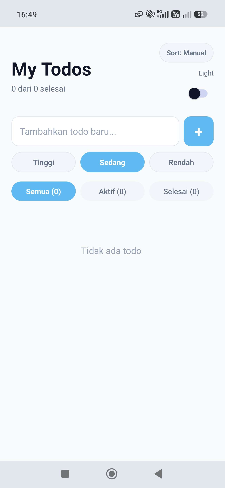
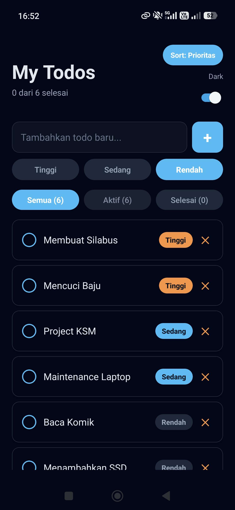

# Todo App

## Informasi Mahasiswa
- Nama : Naufal Rakan Ramadhan
- NIM : 2410501042

## Deskripsi Aplikasi
Aplikasi catatan tugas yang membantu mencatat, mengelola, dan memantau progres aktivitas harian. Pengguna dapat menambah todo, menandai selesai/belum, menghapus todo, serta menghapus semua item yang sudah selesai. Selain itu tersedia filter (All/Active/Done), mode sort Manual/Prioritas, dan fitur drag & drop untuk mengatur urutan todo sesuai kebutuhan.

## Fitur yang Diimplementasikan
- Implementasi `TodoReducer`
- `TodoContext` dengan `TodoProvider` yang menggunakan `useReducer`
- Custom hook `useTodos()` dengan fitur filter todo
- Komponen `TodoItem`, `AddTodoForm`, dan `FilterBar`
- Persist data todo menggunakan `AsyncStorage`
- `HomeScreen` menggabungkan semua komponen dan hooks
- Dark Mode: toggle dark/light mode menggunakan Context API terpisah
- Drag & Reorder: mengubah urutan todo menggunakan `react-native-reanimated`
- Priority: menambahkan prioritas (tinggi/sedang/rendah) dan sorting berdasarkan prioritas

## Screenshot

### Light Mode

  

### Dark Mode

  

## Cara Menjalankan
npm install && npx expo start
